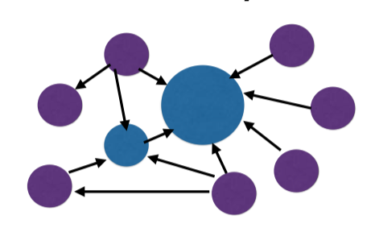
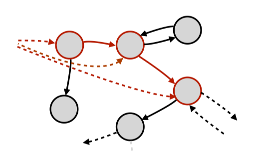

# 7 - Qualities of Codebases

In this chapter we look at design styles and characteristics that can cause problems with the future flexibility and maintainability of code, how we can measure them, and how we can try to fix them.

## Immobility

Immobility is when it is hard to reuse the elements of the code in other applications, the tools described further, help us understand immobility of our codebase better.

#### Stability

Stability is the ratio of afferent to efferent coupling - balance of independence and responsibility.

Objects at the core of the system, that have a lot of other components depend on, should be stable and change rarely.

Components that change often, hence are unstable, we hope that they do exist only on the edge oa a system (perhaps depending on many things, but little depending on them).

#### Dependency Structure Matrix

Helps compare afferent to efferent coupling for different modules and can also help us detect cycles in the dependency graph.

## Fragility (Law of Demeter)

Fragility is when we change on part and other parts break unexpectedly.
Informally known as a train wreck `java getX().getY().getZ().doSomething()`, this characteristic indicates the code might be fragile. By doing this we traverse the object graph, creating a lot of dependencies, which makes our code very **fragile**.

The **Law of Demeter** is a principle in OOP hat aims to follow _Tell Don't Ask_, and is summarised as follows:

- each unit should have only limited knowledge about other units: only units "closely" related to the current unit
- each unit should only talk to its friends; don't talk to strangers
- only talk to immediate friends

## Rigidity

Common cause of rigidity (code that is difficult to change), is high degree of complexity. Often this is a sign that one piece of code is doing many things, with many different conditional branches. If the code is complex to understand, it will be hard to change.

Measures of complexity:

- **Cyclomatic Complexity** (a sophisticated method / computationally expensive, that counts nodes and edges in the control flow graph)
- **WILT** - Whiltespace Integrated over Lines of Text calculates the amount of white space before the statements, the more white space the more complex the code.
- **Turbulence** - plots number of commits that have been made to each file against the complexity of the code in that file.
