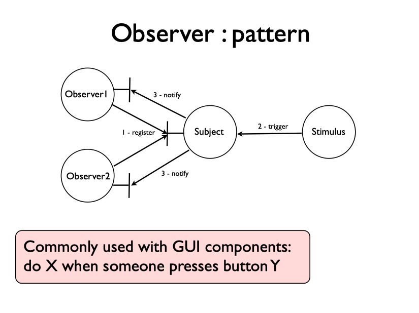
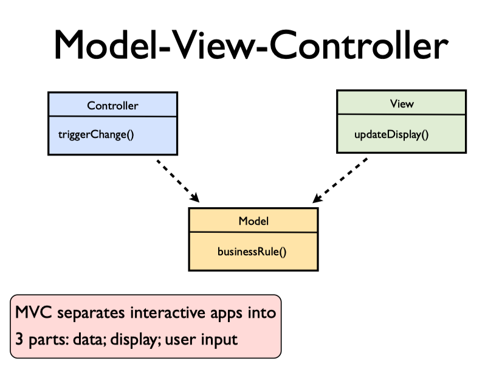
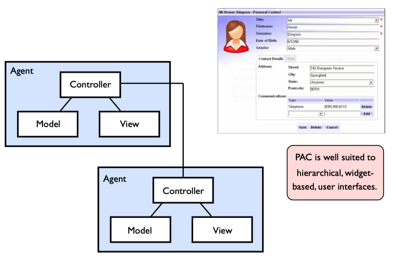

# 10 - Interactive Applications

We often use a library of components to put together a user interface. It comprises a collection of different types of widget classes that can be assembled to display windows, menus and dialog boxes.

## Events

We want to give control to the user executing code in response to actions in the UI, rather than keeping control in the heart of our program. Below a snipped of JavaScript attached to an element in HTML document, where when a button is clicked it triggers an event and JavaScript is called. This is event-based programming model.

```html
<html>
  <body>
    <button onclick="alert('Clicked');">
      Press Me!
    </button>
  </body>
</html>
```

## Observer Pattern

The model where we do something in response to an event, is known as the **Observer Pattern**. However we invert the control of the program, so that instead of calling the widget to ask whether it has been pressed, we _register an object to be notified when something of interest happens_. We can register a number of observers, all looking at the same subject and each gets informed of changes.



## Model-View-Controller Pattern

This is one of the most common architectures for a GUI application. MVC splits the **data model** from the **view** which displays on top of the same data.

- **controller**
  - makes updates to the model by calling on its objects in response to external events (e.g. clicks in the UI).
  - may trigger the view to redraw itself after an event
- view
  - contains code on how to display things
- model
  - stores the data
  - contains logical operations to act upon the data
  - contains query methods for the view to read relevant parts of the model

Note the distinction between commands, which update the model, and queries that just allow access to data values.



## Presentation-Abstraction-Control

This is an alternative for MVC, although used rather less often. PAC architectures are well suited to GUIs where there is a hierarchy to the user interface - so panels contain sub-panels, each of which has a group of controls or displays for a certain item of data.

PAC defines a set of _"mini-MVC"_ agents. We form these agents into a tree and communication between different widgets on the page goes via connections between controllers.
We should only communicate up and down the tree, rather than jumping across to another branch.


