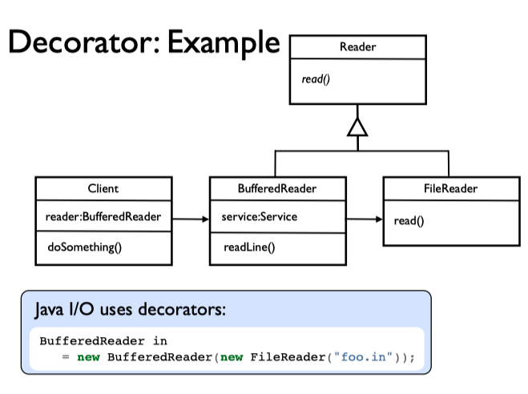
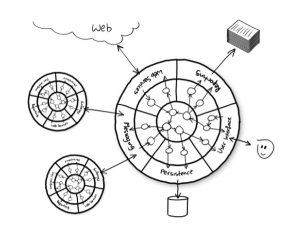

# 11 - System Integration

It has long been a goal of software engineers to produce software components that could be bought or downloaded and assembled into new systems.

## Adapter Design Pattern

When we can use a component, which has the behaviour that we want, but wrong interface, we can use an Adapter pattern to convert from one interface to another.

Below is an example of the adapter pattern. The client uses a logger. We have decided that we would rather send our log messages out as emails, instead of writing them into files. We have an EmailSender, but we want to use it as a Logger. We write an EmailLogAdapter that knows how to implement log(msg) by interacting with the EmailSender's provided methods. The Client doesn't need to change anything.

## Decorator Design Pattern

There are cases when we have something we could use (i.e. it has the right interface) but we want to add in some extra behaviour. We have X, but in some cases we'd like a better, enriched X. We can decorate our X with another object that adds on our extra behaviour dynamically.

I/O classes in Java standard library make extensive use of the decorator pattern. For example, we can read a file byte by byte using a FileReader, but it's often useful to buffer these bytes rather than reading from the file directly all the time. We can wrap a BufferReader around our FileReader to add this behaviour. The BufferReader just deals with buffering, the rest of the reading operatiosn are handled by the underlying FileReader.

## Facade Pattern

Sometimes we have a very complex objet, with many possible behaviours, but only need to use a part of it. We'd like to cover up some of the complexity that we don't need to make things simpler to understand.

This can be achieved using a Facade Pattern. This again Involves wrapping a number of underlying objects that actually provide the service, and delegating to them as necessary. The facade **doesn't normally add behaviour**, it just **co-ordinates between underlying objects or hides some of the complexity** by not revealing all of the possible methods.

## Simplificator Pattern

A variation on Facade Design Pattern, when communicating between systems rather than individual objects, is the Simplicator. It has the same motivation as the Facade, it makes our interaction with another system simpler giving us a nicer interface that is easier to work with. Typically we may implement a Simplicator as an HTTP service, which connects to another remote service using a more complex protocol.

## Proxy Pattern

Sometimes we want to use data from a remote service, but it is too slow. We want to add something in to the system to make the service more responsive (or appear to be so). We want the proxy to interpose between our client and our server. This may serve different purposes. Again it is using the technique of delegation, where the proxy doesn't actually implement the service, it delegates all that it cannot do to the server, it just presents a more responsive front to client.

In the example below we use a proxy in place of the real service. As they implement the same interface, it makes no difference to the client. Here we use a proxy that works as an adaptor - it provides a _"local"_ service to its client, which just calls another object, but implements it by accessing a remote version of the service over HTTP.

## Caching Pattern

If we are using a remote service, and it has high latency, we may be able to cache results locally to reduce the latency of subsequent calls to the service. We use a proxy that maintains a local map of query parameters to results. For each request we look it up in the map, if it is there, we return without going to the remote service. If the map doesn't contain an entry for the query, we go to the remote service, perform the query and then put the result into the cache before we return it. We may need to expire data from the cache when it gets stale, or when cache gets too large.

## HTTP Caching + Simplicators

Caching is so commonly used in some environments that we can use off the shelf products. For example we often use HTTP caches (like squid, or varnish) together with HTTP web sites or services. Returning to the Simplicator that we described in a previous slide, if we implement it as an HTTP service, we can speed up its performance by inserting an off-the-shelf HTTP cache, and with careful use of cache-control headers can refetch data from the source when required.
http caching + simplicators.

## Hexagonal Architectures

The diagram below shows an example of Hexagonal Architecture - also known as Ports and Adapters. The idea of this architecture is that it separates core application logic from particular services on which the application relies, only accessing them through a set of adapters, so there is no direct dependency of the core of our system on another system or library from a third party. This isolation makes it easier to swap implementation of the third party service for another, without impacting (or having to change the source code of) the core application.

There are huge advantages of using such an architecture, when considering testing of the system at all three levels:

- unit tests
- integration tests
- system tests

Different sorts of tests can be used to test our system effectively at different levels. Each gives a different sort of assurance and confidence about the quality of the system.

### Unit Tests

Unit tests can test individual elements of the core of our application in isolation, without any dependence on external components. We might typically expect a large suite of unit tests, covering many cases, yet which runs quickly (in a few seconds, even for thousands of tests), so can be run often during development. Any external services can be mocked at the adapter level, and the mock plugged in to the port during testing.

### Integration Tests

Integration tests have a different purpose. They test some code that we wrote against some code from a third party, to check that the integration works correctly. This is how we might test our adapters. We do not use these to test the logic of our application - just that the basic connections and translations to external services are working correctly. For example, an integration test for MySQL database adapter might create some objects, save them into the database, perform some updates, and then run some queries to make sure that relevant objects can be retrieved, and SQL syntax is correct, any serialisation and deserialisation works correctly.

### System Tests

System tests give us information about a different sort of quality. They tell us that the whole system is wired together correctly, and that data flows between all the relevant components in the expected way. We might have a relatively small number of system tests, as these are typically slower to run and just test a couple of the main scenarios end-to-end. We might run these sorts of tests as a final check of configuration before declaring a potentially releasable version. We would not expect these to check every possible behaviour of the system, as that would typically be a slow and awkward way to test.

