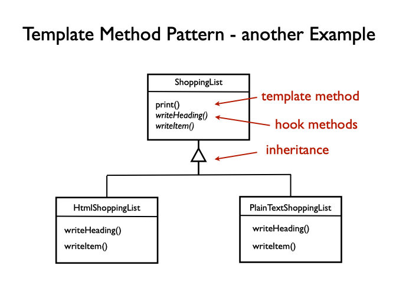
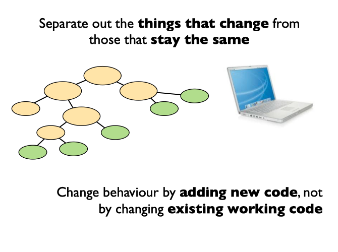
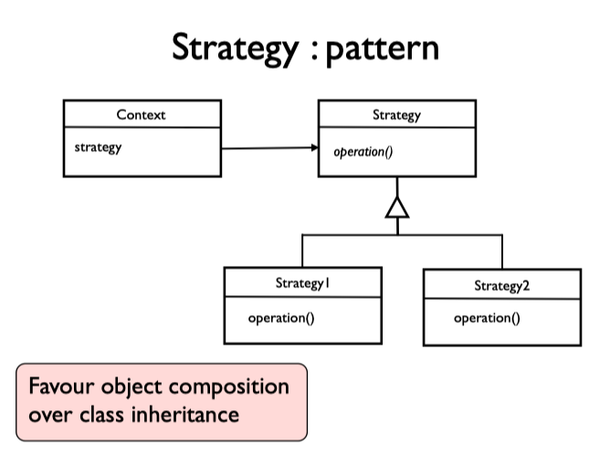

# 6 - Re-use and extensibility

How do we write code in a way that promotes reusable components and allows us to build systems that are extensible so that we can change them over time to keep up with changing requirements.

## Design Patterns

The book Design Patterns (known as Gang of Four), contains a number of patterns that are possible solutions to frequently occurring problems in object-oriented design. The books on design patterns talk about interactions between collaborating objects and the structures they form (design patterns are not language specific).

Most books follow similar form when describing patterns:

- **Name**: handle for design problem/solution
- **Problem**: intent, motivation, applicability
- **Solution**: elements, relationships, collaborations
- **Consequences**: results and trade-offs

Objects that work together are called _"collaborators"_.

## Template Method Design Pattern

We define the main part of the algorithm in the superclass, but call out to some abstract hook methods, which will be overridden in subclasses to specify particular behaviour of different variants. If we need to update code we can do it in one place, and it applies to all specialisations.

It is an example of what is sometimes called the Hollywood Principle: _"Don't call us, we'll call you"_. The concrete classes don't call into the superclass, they just define some methods that will be called when the superclass needs them.

## Open-Closed Principle

The implementation using Template Method exemplifies Open-Closed Principle, which states that modules are written in a way that they can be extended, without requiring for them to be modified. This is a core principle of designing maintainable large-scale systems.

Template method does have a problem that we have tight coupling between the subclasses and the superclass. We can't use subclasses independently or use them in a different system, because they depend on the named superclass. This is a problem of _immobility_ caused by **coupling**.

## What is bad design?

- **Rigidity** - where software is hard to change
- **Fragility** - where when we change one part, other parts break unexpectedly
- **Immobility** - where it is hard to reuse elements of the code in other applications

## Coupling Metrics

**Affeterent coupling (Ca)**: measure of how many other classes use the specific class (indicates level of responsibility).

**Efferent coupling (Ce)**: measure of how many different classes are used by the specific class (indicated level of independence).

## Strategy Design Pattern

Rather than using inheritance, use peers to collaborate. Delegate to a collaborator (rather then a subclass). Pull the algorithm into a separate object, but have a \_"has a" relationship between sequence and it's term calculator. WE can configure which variant we want at construction time, by passing in a particular Strategy as a constructor parameter to teh sequence object. Typically we prefer to use interface implementation rather than inheritance.

Strategy pattern gives us more flexibility here as we compose the objects together, which is looser coupling than using inheritance.
